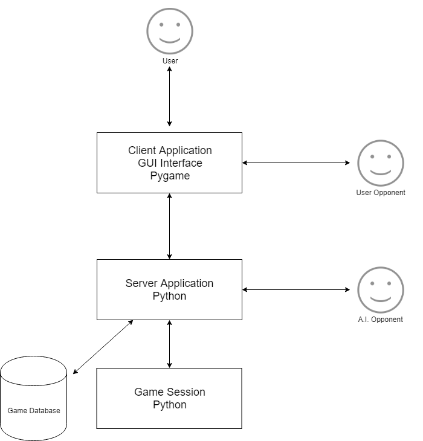
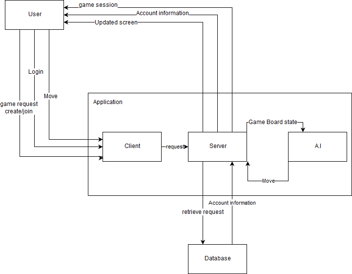
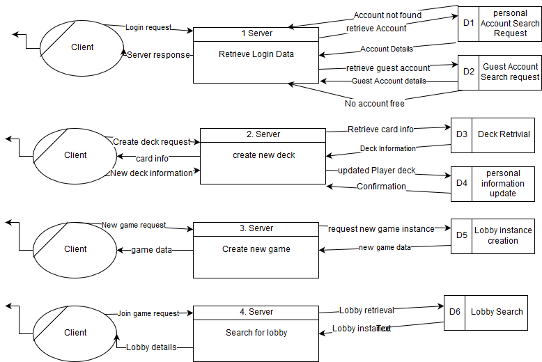
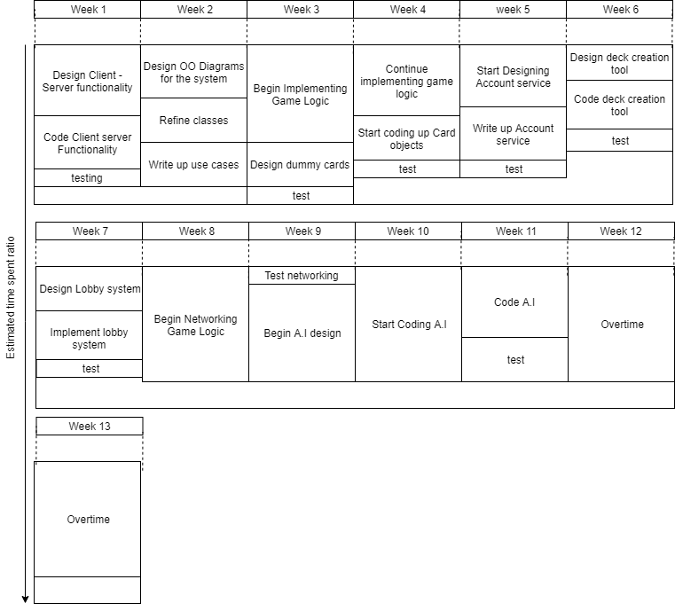

CA326 Functional Specification

**0.Table of Contents**

    Section                                 Page
    1. Introduction
        1.1 Overview.                       2
        1.2 Glossary.                       3
            
    2. General Description.
        2.1 Product System / Functions       3
        2.2 User Characteristics             6
        2.3 Operational Scenarios            7
        2.4 Constraints                      8
            
    3. Functional Description.
        3.1 User Details.                    9
        3.2 Using the deck Creation tool.    10
        3.3 Fighting against an A.I.         11
        3.4 Fighting against another Player. 11
        3.5 GUI Interaction.                 12
            
    4. System Architecture.
        System Architecture diagram.         13
        
    5. High Level Design
        Context Diagram                      14
        DFD (Data Flow Diagram)              15
        
    6. Preliminary Schedule
        Schedule Diagram                     16
        
    7.Appendices
        Extra relevant information           16

**1. Introduction**

**1.1 Overview**

This application is an online implementation of the table top card collecting game called Magic The Gathering created by the company Wizards of the Coast. Currently there are no available applications for Magic the Gathering which allow single player games against an efficient A.I adversary. This application will allow its users to face off against one another in the form of 1v1 battles as well as face off against an A.I program in a single player game. Each user will either have a personal account or may log in using the guest feature which will discard that player data after they log out such as decks that the player has constructed as a guest. The personal account will store that particular users deck that they have previously constructed. A player can construct as many decks as they wish from a pool of predefined cards. The A.I adversary will be using one of 5 pre-made decks when facing against a user.

Since this application will be hosting user&#39;s personal information such as passwords and usernames/emails this information will need to be encrypted using a strong encryption standard.

**1.2 Glossary**

_Python_

Python is a high level programming language which can be used for Functional and Object Oriented Implementations. These are different methods to designing and writing a program.

_Pygame_

Pygame is a python based cross-platform designed for creating video-games. It consists of graphical and sound libraries.

_A.I_

Stands forArtificial intelligence. This means that an A.I opponent will have no user controlling its actions but instead is controlled by an algorithm working in the background.

_Mulligan_

A mulligan is when a player will shuffle their beginning hand into their deck then redraw a new hand of the same size minus one card.

_GUI_

The GUI (Graphical User Interface) is the method in which users can interact with a program through use of objects drawn onto the users screen such as text boxes, buttons, graphical icons, animations etc.

**2. General Description**

**2.1 product / System Functions**

  _User access system functionality_
  
Firstly all users will have to download the application onto their Desktop device or Laptop. This can be done simply by allowing them to pull the current version of the game from a web based server. After downloading the game they can run the client application which will connect them to the server and ask them to either create an account, log into their already existing account. or the user may choose to log on as a guest.

The server upon receiving new account information will store it into its database and encrypt it for safety. If an account already exists it will simply update that account whenever a change to that players data is made. These changes include things such as creating or deleting a decks, changing user names or passwords etc. If a player forgets either their username or password that player may request a reset via security question.

_Matchmaking system functionality_

In the lobby a player can select to either play against another player in an online 1v1 scenario, or play against an A.I opponent in a single player environment.

In a multiplayer scenario a player will be presented with a list of open lobbies. They can either join an open lobby or create their own lobby. Once in a lobby a player can choose which deck he would like to play with. Once both players are ready the game will launched.

In a single player game a player will be automatically put into a lobby. Once in a lobby he will select with which deck they would like to play from their own pool of decks. Then they will choose with which deck that the A.I shall play. After that the game will be launched.

_Match System functionality_

At the beginning of each match each player(A.I included) will receive the top 7 cards of their respective decks. After that the first player is chosen at random. That player chooses to keep their hand or mulligan. They then take their turn  playing a land card if possible, playing whatever cards they want and fighting with whatever available creatures they want. After that they end their turn and the second player begins their turn by drawing a card from their respective deck. From that point on this cycle repeats itself until either players health pool is reduced from 20 to 0 or one of the players is forced to draw when they have no more cards in their deck.

_Database functionality_

Whenever a user enters the game it will be using a personal account or a guest account. Both instances of these will be hosted on a database.

When a user tries to enter the game using a personal account they will be asked to enter a username and a password. This will query our database to search for a player entry with this username and password. If the data provided doesn&#39;t match it will inform the player that no user with that username and password was found and be asked to re enter the information. Otherwise the database will send their details to them (such as a list of decks) and they will be presented with the welcome screen and the main menu of the game.

When a user presses the play as guest button the program will query the database to see if there is a guest account that isn&#39;t currently in use. If one does it will send its details to that user and the user will be forwarded to the welcome screen and main menu of the game as a guest.

_GUI functionality_

The GUI for the application will be split among a number of different screens being:

- Log in Screen
  - Username (field)
  - Password (field)
  - Forgot password (button)
  - Create account (button)
- Create Account Screen
  - Username (field)
  - Password (field)
  - Security Question and Answer (field)
- Main Menu Screen
  - Create a new deck (button)
  - Change account details (disabled on guest accounts) (button)
  - View available games (slidedown list)
  - Create their own game (button)
  - Exit the application (button)
- Deck Creation Screen
  - List of cards (list representation)
  - Current deck state(list representation)
  - Add land(button)
  - Add card(button)
  - Save as(button)
- Lobby screen
  - Choose deck(button leading into slidedown list)
  - Ready up (button)
- Game screen
  - Players&#39; life points (field)
  - Player&#39;s current hand (visible)(field with clickable images)
  - Enemy&#39;s current hand (hidden)(field)
  - Battlefield (combat zone)(field with clickable images)
  - Graveyard(button)
  - Land Zone (resource zone)

The GUI will be displayed via Pygame to the user with the underlying logic being implemented through the Python programming language.

**2.2 Users Characteristics**

The users for this particular application we expect to be people who are familiar with the original table top card collecting game MTG(Magic the Gathering). These users can be anything from 13 years old to 30+ years old. Because of this gap in the expected age we believe that the technical capabilities of our users will differ greatly. As such we plan to make our application easy to use and simple in design. It is an assumed requirement of the users to easily be able Log In/Create Account and quickly begin creating their own decks and begin playing games.

We can safely assume that the users expect a full MTG experience meaning a working representation of the table top version of MTG with deck creation being a big part of that experience. A user will be able to create any deck they want from a pool of cards we provide.

Users will expect little to no connection issues when playing against other players in the 1v1 scenario. It is a users objective to be able to complete a game with no interruptions and in a natural fashion as if they were playing the actual tabletop game in real life.

Users will expect a responsive and efficient A.I adversary to be playing against in a 1 v A.I scenario. Again it is a users objective to be able to complete the game without any unnecessary wait time between A.I calculation and in a natural fashion as if they were playing the actual tabletop game in real life. This will require the application&#39;s A.I algorithm to be written efficiently.

**2.3 operational Scenarios**

_User Logs In/User Logs Out_

A user tries to log in using their personal account. They enter their username and password and click the login button. They are then presented with the welcome screen and the main menu screen. They then click the logout/exit button and are presented with the the goodbye screen and the application closes.

_User Creates an Account_

The user will be prompted with a box containing 5 data fields, &quot;Enter Username&quot;, &quot;Enter Password&quot;, &quot;Confirm Password&quot;, &quot;Enter A Security Question&quot;, &quot;Enter Security Answer&quot;. If the chosen username is not taken by another user currently in the database and the passwords match, the users information will be added to the database for the game, else, the user will be prompted with the appropriate error message and then be asked to re enter their account information.

_User Forgets Password_

The user clicks on the &quot;Forgot password&quot; button on the Login screen. They are then presented with the forgot password screen. There they will be asked to fill in a user name field. After filling it in and clicking submit they recieve a new screen. On that screen they are prompted with a security question and an answer field. The user fills out the field and clicks submit. The screen displays a message &quot;Thank you&quot; and present them with a reset password screen. That screen they will see two fields &quot;new password&quot; and &quot;confirm password&quot;. After filling those in they will be prompted with a message &quot;Thank you. Returning back to login screen&quot; after which the user returns to login screen

_User Creates a Deck_

After user Logs In the user clicks on the Create a deck button. They are then presented with the Deck Creation screen. The user clicks on a card they wish to add to their new deck. The user then clicks on the add card button and the deck appears in the current deck status field. Once a deck is made they click save as button. They then chose the name for their deck and click the save button. The user is then presented with the same screen as before. They then click the return to main menu button and return to the main menu screen

_User Creates a Game_

From the main menu the user selects the option to create a new game. The user is then presented with the option to either play online versus another player or they may choose to play versus an A.I opponent. After the user has selected One of these options they are then prompted with a field to enter the game&#39;s name. The user enters the game&#39;s and clicks saves game, otherwise the user may click cancel to exit the function..

_User Plays a Game_

After a player joins a lobby and a game starts he is presented with the game screen. The player then will see their current hand in the bottom of the screen and await their turn. They will then choose to either mulligan or keep. They will then take their turn by playing a land card if they can and any of the cards they can/want to play that turn. They will then attack with any creatures they can/want. They will then play another card if they so choose and end their turn.

After 10 turns the user on his turn hits the enemy with a creature and reduces their health pool to below 0. The user is then prompted with a message &quot;You&#39;ve won&quot;. After a small wait time they are then presented with the lobby again.

**2.4 Constraints** These are the probable constraints on the design team of this application.

_Time constraints_

This project is due at the end of the second semester of 2018/2019 academic year. This could prove to be a limiting factor as to how well extensively completed the finished the project will be.

_User requirements_

Will we be able to fully understand what the user needs are in this project and will we be able to address them once we do.

_Knowledge gaps_

 The usage of unfamiliar software may prove time consuming while learning this new software

_Technological Requirements_

Will we be able to accurately host a server and a database for our game to be fully functional  and support a working networking interaction as per this document.

_A.I. efficiency constraints_

It is not only necessary for the application&#39;s A.I. implementation to calculate smart and logical moves when facing against the user but it is also crucial that the A.I functions efficiently both in a time sense and a memory sense. The user does not want to wait long periods of time while the A.I. is attempting to calculate its next move. The A.I must also not consume too much memory while executing as this would slow the application down.

**3. Functional Description**

**3.1 User details**

_Description_

The application must have a way of distinguishing between each users personal account details such as passwords and usernames. This will be done by utilizing a database.

_Criticality_

These details are important for when we want to create a player vs player functionality. Using these details we will be able to distinguish between players.

_Technical issues_

The two main issues that need to be addressed is that each username must be unique and that all of this data needs to be encrypted for security measures.

_Dependencies with other requirements_

This is the main part of how our system distinguishes between entities, without this we will not be able to create a full functional multiplayer experience.

**3.2 Using the deck creation tool**

_Description_

We believe this will be the first thing the users will be exploring. After logging in the users will most likely either create a deck or view available decks. This means that the client side application  must communicate with the player database in a perfect and efficient manner so that the information pulled from it belongs to that user and so that when a user updates his deck list it is pushed to the right section as well.

_Criticality_

It is hugely important to get this step right as most of our player information will be stored in that database. When a player decides to play a game or create a new deck they expect their personal decks that they have create be there untouched.

_Technical Issues_

This can be done by making sure no duplicate entries of users exist and that when adding information or changing information in our database we do not simply overwrite old data with new but rather update it accordingly. This will require careful coding and understanding of how databases work. If a technical fault is made to this database it could prove to be quite significant.

_Dependencies with other requirements_

This directly corresponds to one of our main requirements which is that each user would like the ability to personalise their own deck. This stems from the fact that the tabletop version of the game is a card collecting game which means each player can have their own personalised deck from the cards they have collected over the years.

**3.3 Fighting against an A.I**

_Description_

This is the main hurdle of the project. The A.I we create has to be an intelligent, efficient and responsive program that will act as if it was a real player. This means the creation of an algorithm that will calculate what the current board state is to determine what its next move should be. This calculation will need to take place as the game moves from phase to phase.

_Criticality_

The selling point of this application is that it allows for the possibility of a single player MTG match against an opponent even if no one else is around. As such we believe this to be of high priority in our implementation goals.

_Technical issues_

We may run into trouble with computing power as the more accurate the calculations may get the more demanding the A.I might become when it comes to memory allocation. This could be solved by minimizing the amount of data needed to be processed or improving the hardware on which the A.I will be running.

_Dependencies with other requirements_

This directly connects to our requirement of the players being able to play against an A.I. in a fast and efficient manner. In our understanding the users are looking for smooth and relatively fast games against the A.I.

**3.4 Fighting against another player**

_Description_

After logging in and creating their deck the user will want to either fight the A.I or another user in a 1v1 scenario. This will require a networking system which allows multiple players to interact with a game instance. It will also require a matchmaking system which will effectively connect users together to form lobbies of games. Once in a game it will be the applications responsibility to monitor both users moves and transfer player priority when it&#39;s their turn. The application will also monitor the current health pool status along with remaining number of cards in each deck and declare the winner once a winner is determined.

_Criticality_

This is in particular is going to be the longest part of this project hence why its priority will be stretched out through out the full time of this project. However it is of utmost importance that the environment specified above should work perfectly as it will be the main part of this project.

_Technical issues_

The users will need to be familiar with how the matchmaking system works and how the game works.

_Dependencies with other requirements_

This feature interact with almost all aspects of the requirements. Users will connect to each other with their Usernames and will face off in an online 1 v 1 scenario using their previously constructed decks. This will only work if all users have unique usernames, the database is working correctly and the networking aspect of the game is fully functional.

**3.5 GUI Interaction**

_Description_

This will be the way that all of our users will interact with the application. All menu screens and the game screen itself will consist of mouse clickable buttons which all need to correspond to some function calls. This needs to implemented correctly using Pygame.

_Criticality_

This is a crucial part of the project since without a GUI we believe that this project will be too overwhelming for the users to understand. As such this is one of the high priority tasks we have on our list however its priority is relative to what other parts of the application are completed.

_Technical Difficulties_

The size and colour of each object on the screen must be clear and easy to notice for the user. The information must not be too overwhelming but should display enough information for the user to be able to interact and navigate easily.

_Dependencies with other requirements_

This directly connects with our requirement of out project being very accessible and easy to use. Without a fully functional GUI we would be forced to run this on a command line which would immediately turn away most people

**4. System Architecture**

This is the proposed Architecture of the application and the interactions with its different users and systems.

The System will be composed of

- A client application running on python and being displayed through Pygame
- A server application running through python
- A game database, containing account information and card information
- A game session hosted by the server maintaining connection between either two users or a user and an A.I application.

 
 
**5. High Level Design**

Using some SSADM techniques we have constructed some diagrams to explain our initial design of the system

_Context Diagram_

This diagram will depict how the different entities from outside of the system interact with the core system.

 
 
_DFD (Data Flow Diagram)_

This high level diagram details a portion of the flow of data that will occur within the application.

**6. Preliminary Schedule**
 

**N.B -** After each section of the application is implemented logically the UI will be worked on via Pygame.

**7. Appendices**

_Wizard&#39;s of The Coast_

[_http://company.wizards.com/_](http://company.wizards.com/)

_How to play Magic The Gathering_

[_https://magic.wizards.com/en/gameplay/how-to-play_](https://magic.wizards.com/en/gameplay/how-to-play)

_Python_

[_https://www.python.org/_](https://www.python.org/)

_PyGame_

[_https://www.pygame.org/news_](https://www.pygame.org/news)

