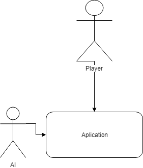
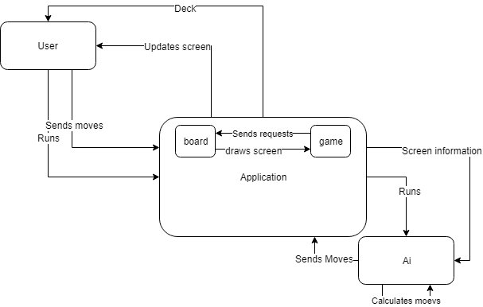

# Introduction

# Overview

This is a technical manual for the third year project Magic The Gathering (MTG) Ai Implementation. It will consist of a detailed descriptions of the functions used throughout the system. This project seeks to create a virtual environment in which a person can experience MTG as if they were playing the card game. It also seeks to create a virtual opponent that can be fought against offline. This opponent should prove to make intelligent decisions as if it were another player.

This system has been built using python 3.7.2 the newest release of the Pygame library. Pygame is open source library for python for building multimedia applications. It is highly flexible as it runs on every platform and operating system.

This manual expects you to have read the user manual and expects you to be familiar with the rules of MTG. The system incorporates all functionality of the python programming language.

Glossary

Mtg = Magic the Gathering

AI = Artificial Intelligence

Combat state = A card in the game can be either a neutral, defending or attacking state

Tapped = A card is tapped when it is selected for combat. A tapped card cannot defend on the opponent&#39;s turn

Untapped = The process of returning a card from a tapped state

Mana cost = the amount of lands that need to be tapped in order for you to play a card

Land = type of card that you can play once a turn for no mana cost

Board state = The current amount of cards on each players battlefield combined with the total toughness and power of each creature

# System Architecture

This is the system as it is now with its interactions from other system

The system is composed of:
 

- An application running on python being displayed through pygame.
- An Ai application running on python.
- And a player who interact with the application.

# High Level Design
  

Currently at High level the system works in the following way

- A user Starts the application
- The application Runs a game function
- That game function will request a screen to be drawn by the board function
- They will then send that screen back to the player
- The player then makes a move
- The application then sends that move along with the screen information to the ai
- The ai calculates what move it should make
- The ai sends the move to the application

This is a description of how Both the player and the ai interact with the game as it is running

Turn System

Each turn is sub divided into 6 phases. The combat phase is subdivided into 3 more phases and after each phase the opponent has a chance to respond.

Untap

During the untap step the system scans through all the cards currently on the battlefield. It refreshes the combat state of each card, It sets each card back to being untapped and resets all temporary modifiers that each card had on it. This process is the same for each player.

Draw

During this step the player whose turn it is draws the top card of their deck. If a player would have 0 cards left in his deck and would be forced to draw they would automatically lose the game.

Main 1

This phases is different for the Player and the AI

Player:

During the players main phase he has the choice of playing any of the cards in their hand. Each card will have a mana cost that needs to be paid in order for them to be able to cast it. Each card is played by simply dragging it off the player hand section.

Ai :

During the AI&#39;s turn depending on what coloured deck the AI is playing it will make different decisions. However, the main goal for the Ai is to increase its board state, reduce your board state and lower your life total. As such the ai , After playing a land card if available, will look at its total available lands and calculate all possible permutations of cards it can play this turn. For each permutation it will calculate how close it will be to the ideal board state and decide on the most optimal cards it could play this turn.

After any card other than a land is played by either the Player or the Ai, the opposing player enters a response phase.

Combat

Combat phase is broken down into 3 sub phases

Selecting Attacker

Player:

The player select their attackers by left clicking on the card they wish to attack with. A clicked card enters an attacking combat state and it cannot be deselected. All creatures that are attacking are now tapped.(For more information please read User manual).

Ai:

Similarly to a player the Ai also chooses their attackers. It does so by yet again calculating all possible permutations of possible attacks and possible defenders from the opponent. It then calculates what set of defenders will lead the Player to sustain the last amount of damage to their life total while maintaining a lead in the board state. The Ai then compares each one of its permutations against this possible best case scenario and comes up with the most viable move that the player would make given some set of attackers. Given this information it then chooses its attackers and awaits blockers.

Selecting Defenders/Blockers

Player:

The Player selects from his battle field any number of creatures lower than or equal to the number of attackers to defend. They do so by clicking on an untapped creature on their play field and then clicking which attacker they wish to block.

Ai:

The Ai selects his defenders by running calculations similar to the ones described before. The Ai compares a set of all possible permutations of blockers to a list of attacking creatures. This yields different results in terms of the board state. Depending on the colour of the Ai you&#39;re fighting against you can expect it to either try and destroy most of your attackers or keep their side of the field wider to attack you when your weakest

After the selection of attacker and defenders steps are done we enter the damage step. This step is the same for both the Ai and the Player. Each attacking creature power is compared to a defender&#39;s toughness and vice versa. When the power exceeds the toughness the creature with said toughness is dead.

Main Phase 2.

This phase is the same exact logic as the Main phase one.

End Step

This is the final step for either player. During this step the system will scan both playing fields and search for all creatures with any negative toughness and reset it to its original value, reset any and all temporary effects that any creature and/or player would have such as protection.

Response phase

After any player plays a card and before a players enters the next phase during their turn the opponent enters a response phase. In this phase the opponent can play any instant if he can pay its mana cost.

Problems and Resolutions

Here are a list some of the major problems we had encountered throughout our implementation.

The AI

When designing the system we came up with a set of functions which we wanted to implement in our ai. However due to the constraints on what information the Ai has access to we couldn&#39;t fully implement all of them. One of which was a function which work out the probability of an opponent having a particular card in hand. Since we can&#39;t give the Ai the cards that the opponent has in his deck. As such we implemented in our ai the possibility that the opponent has always answer to whatever move it makes so it less likely to make a risky move.

The UI

This was our first time working with pygame. As such our ability to use its library to the fullest extent was limited. Our first UI mockups were fine on paper and through end user tests people were generally happy with it. However upon implementation we found major problems with it. Only after implementing most of our logic. As such we reconstructed the Ui from ground up and had to re-write some functionality

# **Installation Guide**

# This game is python file. As such it doesn&#39;t need an installation. This however requires you to have access to the git where it is stored.
After downloading the repository simply do the following:

1.Enter the directory code

2.Double click mtg.py
With that the the program should be running