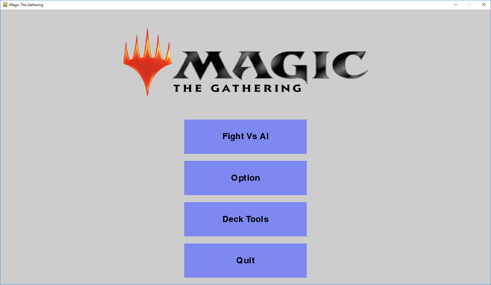
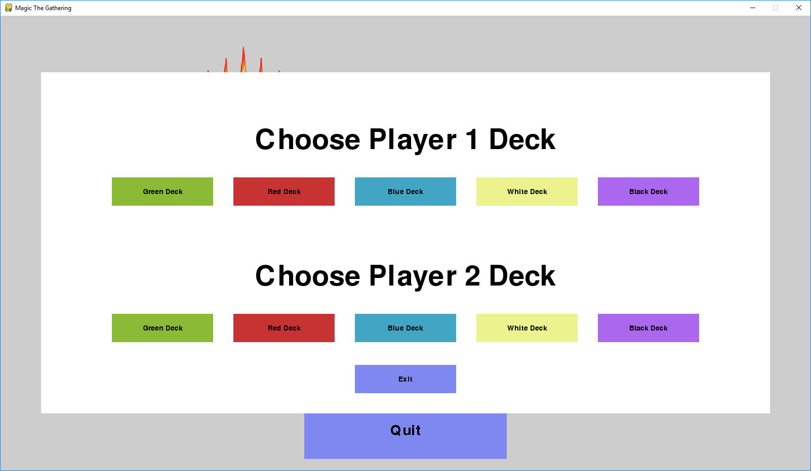
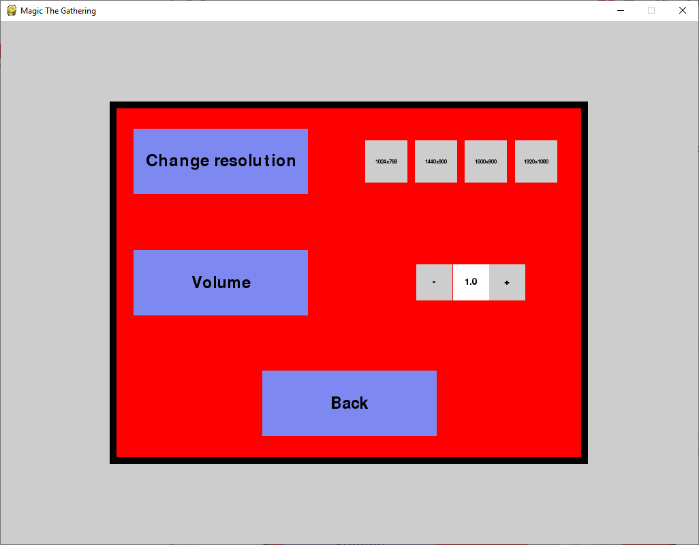
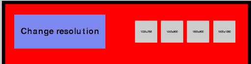
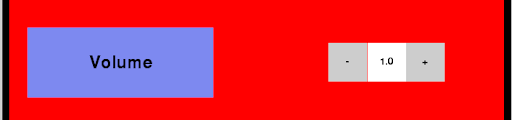

**Introduction**
This is the user manual for the third year project Magic The Gathering(MTG) Ai Implementation. This manual will include Instruction on how to play the game and information on all aspects of the game. In order for you to run this game you will need the following on your computer

Python version 3.7 or higher
The newest Pygame library
The game files

**Launching the game**
There are two ways of launching the game

To Launch the game open your command line terminal and enter the directory where the game is installed.
Then run _mtg.py_ in your command line.

Using nay file explorer open the directory where the game has been downloaded. Double click on mtg.py to run the program

**Game Intro Screen**
When the game is launched you will be met with the intro screen. This screen is divided into 4 buttons
 
**Quit**
This is a simple quit button that closes the game and kills the process

**Deck Tools**
This screen allows you to choose which deck you would like to play with and which deck you would like to go against. For the deck list please look at the end of the Manual.
 
**Options**
This is a simple options menu with two options
 
**Change resolution**
This is a simple click and select option which will resize your screen to the resolution displayed. The default resolution of the screen is 1600x900
 
**Volume**
This is a simple change volume button. Click on the minus to decrease the volume in game and click on the plus to increase. The maximum volume of the game is 1.0 and the lowest is 0.0. Each click on either the plus or minus will increase or decrease the volume by 0.1.
 
Play Vs Ai
This button will launch the main game and depending on which deck you have chosen you will be assigned said deck.

The Game and Game Rules

**Types of cards**

**Creatures**
These cards are Identified by the type shown in the middle of the card and by the power and toughness displayed in the bottom right corner of the card. Some creature cards will have a _Keyword_ giving it some special ability. Each Keyword is described on a card. For a list of all Keywords and their explanation you can also visit the appendix

**Sorcery**
These cards are Identified by the type show in the middle of the card. They are cards with specific effects which is described on them. For a list of all effects and their full explanation you can also visit the appendix.

**Instant**
These cards are Identified by the type shown in the middle of the card.
They are cards with specific effects similar to those from Sorceries. However these cards can be played during your opponent&#39;s turn. For more information visit the Phase section of combat rules.

**Lands**
These cards are Identified by the artwork spanning the full length of the card. They are the only type of card that has an atwork the full length of it. They are used to generate mana. More information on mana in playing a card section.

**How to play magic**
The game is broken down into a set of phases. Each phase allows you to play different cards.

**Untap**
During this phase the current player untaps all of their creatures and lands if they were tapped from his previous turn.

**Draw**
During this phase the current player draws the top card of their deck(library). If a player is forced to draw and has no cards left in their deck they lose the game.

**Main Phase**
During this phase most of the game takes place. There are 4 things you can do.To play any of the cards below simply click and drag the top of the card outside of the hand section. During this phase you can also hover any card on the battlefield or in your hand to display it fully in the card view section on the left side of your screen. This will tell you the current power and toughness a creature is on. And will allow you to read the effect of the card you wish to play.

**1.Play a Land**
On each of your turns you can play up to 1 Land. These Lands are used to generate mana. You do so by click on a land in your play field. This will rotate the land to signify it is tapped. Each type of land will generate a certain colour of mana. You can tell what colour it generates by either looking at the name of a land card or by inspecting its colour.
For a list of lands and the mana they generate you can also check the appendix.

**2.Play a Creature**
On each of your turns you can play any amount of creatures as long as you have enough mana to pay its cost. The cost of a creature is displayed at the top right corner of a card. It will consists of either a number of colour symbols or an integer number along with a series of colour symbols. The cost of a creature represents the type of mana and the amount of mana that need to be generated to cast(play) it. Example this card consists of a number 1 and 2 symbols for black mana. This means that you need to generate 2 black mana and 1 any other type of mana before you are allowed to cast this creature.

**3.Play a Sorcery/Instant**
On each of your turns you can play any amount of Instants/Sorceries as long as you have enough mana to pay its cost. The cost works the same way as creature cost. Sorceries can only be played during a Main phase. Instances can be cast during either a main phase or during your response phase. Each instant upon being played will be automatically added to the respective graveyard and displayed in the display last card section of the screen. The caster of that Instant/Sorcery will then be asked to choose their target for the effect. If no targets are available the spell will automatically fizzle and the card will be lost.

**4.Pass**
When you click the pass button on the screen you will enter your next phase. You can also do so by pressing the spacebar button on your keyboard.

**Combat**
This phase is broken down into 3 sub phases

**1.Select Attackers**
During this phase either play has to select their attacking creatures. A creature which has just been cast cannot attack this turn since it has summoning sickness. A creature has summoning sickness if it has a pause button displayed on it on the board. A creature with the keyword Haste does not suffer from summoning sickness.

Once a creature is selected as an attacker it cannot be unselected. All creatures that are selected will become _tapped_ . a _tapped_ creature can&#39;t attack or defend as long as it stays _tapped._ This will be displayed by having the card be rotated similarly to when you tap a land.

Once your attackers are selected press the pass button to enter the next sub phase

**2.Selecting defenders**
During this phase the player who has been attacked may chose blocking creatures. Any creature on the defenders side of the battlefield that isn&#39;t tapped can be used a s a blocker. To select a blocker left click on the creature you would like to block with and then left click on the creature you would like to block. When you do that the chosen creatures will be joined by a black line to signify that the blocker has been assigned. Once a blocker is assigned it cannot be un assigned.
Creatures with the flying keyword can only be blocked by other flying creatures or creatures with reach.

Once the blockers have been assigned if you&#39;re defending press the pass button to enter the final sub phase. If the opponent is defending the next sub phase will start automatically.

**3.Damage Step**
During this step all the attacking creatures and the blockers will battle one by one.If a creature hasn&#39;t been assigned a defender or if the defender doesn&#39;t have flying while the attacker does the creature will deal damage to the opponent equal to its power. Otherwise the attacking creature and its blocker battle. The power of the attacker is compared against the total toughness of the defender and the power of the defender is compared against the total toughness of the attacker. If ones power overcomes the toughness of the other, then that creature dies and is sent to the graveyard. Otherwise until the end of that players turn that creature has reduced toughness based on how much damage it took. You can see how much toughness and power you card has left by hovering over it with your mouse and displaying it in the card view section of the screen.

After the calculation is finished you will be moved into the next phase

**Main Phase 2**
This phase plays out the same way the previous main phase has. If you haven&#39;t played a land during the last main phase you can still do it in this main phase. However you can still only play one land per turn.

**End Phase**
This is the final phase of a players turn. During this phase the game will look through the battlefield and restore every creatures toughness back to original values. It will also remove any temporary statuses placed on either player and all creatures such as Protection.

The game will also check if the player has more cards in their hand than the maximum hand size which is seven. If they do they will be asked to discard a card from their hand. This process will continue until there are 7 or less cards in that players hand. This only concerns the player who is at his end step. If the opposing [player has more than seven cards in their hand while the current player reaches their end step they do not have to discard.

**Response Phase**
Whenever either player plays a card, except for a land, the opposing player enters a response phase. The same occurs whenever a player moves from one phase to another.

During a response phase a player see the card that the opponent has played and can chose to play an Instant if he has to mana to pay its cost. Only instant cards can be played during a response phase.

**The goal of the game**
The goal of the game is to reduce your opponent&#39;s life total to below 0 or make them draw cards from their deck when they have 0 cards left or make them concede.

**The in game menu buttons**
During any stage of your turn you can access the menu buttons in the bottom left corner of your screen. The options button will bring you back to options menu you have seen in the Main menu screen. The concede button will make you automatically forfeit the game and launch you back into the main menu screen so you can try again.

**Appendix**

**Deck list**

**Green**
Name = Forest , Type = Land, Amount = 24

Name = Elf, Type = Creature, Power/Toughness = 1/1, Amount = 4

Name = Giant Beetle, Type = Creature, Power/Toughness = 3/3, Amount = 4

Name = Woodland guardian, Type = creature, Power/Toughness = 4,3 , Keyword = Trample, Amount = 4

Name = World Tree, Type = creature, Power/Toughness = 0,5 , Keyword = Reach, Amount = 4

Name = Rabid Bite, Type = Sorcery, Effect = Combat Creature,

Name = Cultivate, Type = Sorcery, Effect = Search for Land,
Name = Sapling Growth, Type = Sorcery, Effect = Draw card,

Name = Grasping Vine, Type = Sorcery, Effect = Tap creature(s),

**Red**
Name = Mountain, Type = Land, Amount = 24

Name = Goblin, Type = Creature, Power/Toughness = 1/1, Amount = 4

Name =Goblin Rider, Type = Creature, Power/Toughness = 2/2, Keyword = Haste, Amount = 4,

Name = Bomb Enthusiast , Type = creature, Power/Toughness = 4,1 , Keyword = Haste, Amount = 4

Name =Sparky &amp; Jinks, Type = creature, Power/Toughness = 2,4 , Keyword = Flying, Amount = 4

Name = Wall of fire , Type = creature, Power/Toughness = 0,4

Name = Lava Axe, Type = Sorcery, Effect = Deal 4 Damage,

Name = Shock, Type = Instant, Effect = Deal 2 Damage,

Name = Lightning Strike, Type = Instant, Effect =Deal 3 Damage,

Name = Burning Rush, Type = Sorcery, Effect = Draw Card,

**Blue**
Name = Island, Type = Land, Amount = 24

Name = Merfolk, Type = Creature, Power/Toughness = 1/1, Amount = 4

Name = Owl, Type = Creature, Power/Toughness = 11, Keyword = Flying, Amount = 4

Name = Sphinx, Type = creature, Power/Toughness = 4,3 , Keyword = Flying, Amount = 4

Name = Water Dome, Type = creature, Power/Toughness = 0,4 , Amount = 4

Name = Bouncybouncebounce, Type = Sorcery, Effect = Bounce target creature

Name = Tappitytaptap, Type = Sorcery, Effect = Tap target Creature

Name = Recall, Type = Instant, Effect = Bounce target Creature

Name = Divination, Type = Sorcery, Effect = Draw 2 Cards

Name = Clarity, Type = Instant, Effect = Draw a card

**White**
Name = Plains, Type = Land, Amount = 24

Name = Soldier, Type = Creature, Power/Toughness = 1/1, Amount = 4

Name = Hyla&#39;s Maiden, Type = Creature, Power/Toughness = 3,2, Keyword = Vigilance, Amount = 4

Name = Lady Hyla, Type = creature, Power/Toughness = 5,2 , Keyword = Flying, Amount = 4

Name = Wall of light, Type = creature, Power/Toughness = 0,3 , Amount = 4

Name = Healing hands, Type = Sorcery, Effect = Gain 4 Life

Name = Blessed Breath, Type = Sorcery, Effect = Target Creature or Player gains Protection

Name = Path to Exile, Type = Instant, Effect = Exile target Creature

Name = Resurrect, Type = Sorcery, Effect = Reanimate 2 target creatures

Name =Martyr of Dusk, Type = Creature, Power/Toughness = 2/2, Keyword = LifeLink, Amount = 4

**Black**
Name = Swamp, Type = Land, Amount = 24

Name = Zombie, Type = Creature, Power/Toughness = 1/1, Amount = 4

Name = Giant Scorpion, Type = Creature, Power/Toughness = 1,3, Keyword = DeathTouch, Amount = 4

Name = Sengir Vampire, Type = creature, Power/Toughness = 3,3 , Keyword =LifeLink, Amount = 4

Name = Vampire Nighthawk, Type = creature, Power/Toughness = 3,2 , Keyword = Flying, Amount = 4

Name = Demonic Tutor, Type = Sorcery, Effect = Draw 1 card

Name = Reanimate, Type = Sorcery, Effect = Reanimate target creature

Name = Murder, Type = Instant, Effect = Destroy target creature

Name = Duress, Type = Sorcery, Effect = Target player Discards a card

Name = Wall of Limbs, Type = Creature, Power/Toughness = 0/3, Amount = 4

**Effects**
**Tap** = target creature becomes tapped until that player&#39;s untap step

**Damage** = Deal damage to either player or creature specified on the card

**Bounce** = return target creature from playfield back to controllers hand

**Combat Creature** = target creature you control battles target creature you don&#39;t control

**Search Land** = Look at all available lands in you deck and chose one, put on on the playfield untapped

**Gain Life** = target player gains life equal to what is specified on the card

**Protection** = target creature or player cannot be target by spells or die from damage until end of turn

**Exile** = target creature is removed from the game permanently

**Destroy** = target creature is sent to the graveyard

**Discard** = target player reveals their hand to the opponent and they choose which card is sent to the graveyard.

**Reanimate** = Chose target graveyard, chose x creature cards where x is specified on the card. Those creatures are brought back to your playfield under your control

**Keywords**

**Haste** = Creature doesn&#39;t suffer summoning sickness

**Vigilance** = Creature doesn&#39;t tap during combat

**Flying** = creature can only be blocked by other flying creatures

**Trample** = Any damage that overcomes an enemies blockers toughness during the damage step of combat will still be dealt to the opponent

**LifeLink** = Any combat Damage dealt by this creature is gained in life by its controller.

**DeathTouch** = If this creature battles and deals any damage to another target creature, that creature dies.

**Reach** = This creature can block Flying creatures